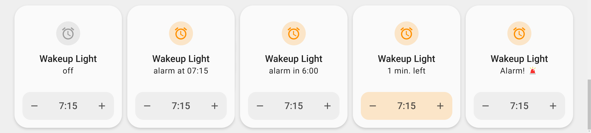

# Wakeup Light Blueprint with Dashboard Card

Wakeup Light gradually increases the brightness of a selected lights over a set period, simulating a sunrise to make waking up more natural and comfortable. It is designed to start dim and reach full brightness at the configured alarm time. Additionally, an optional action can be executed when the alarm triggers. This blueprint provides a smooth and non-intrusive way to wake up, reducing the abruptness of traditional alarms.
Inspired by: sbyx/wake-up-light-alarm-with-sunrise-effect

| Input | Description |
|---|---|
| **Alarm Time Helper** (`time`) | The time when the light reaches full brightness. |
| **Alarm Switch Helper** (`switch`) | Enables or disables the wake-up light. |
| **Alarm State Helper** (`state`) | Stores the alarm status. |
| **Light Entity** (`light`) | The light entity used for the wake-up sequence. |
| **End Brightness** (`brightness_pct`) | Maximum brightness percentage when wake-up is complete. |
| **Fade-in Duration** (`duration`) | Time in minutes over which the brightness increases. |
| **Alarm Action** (`action`) | Optional action to execute at alarm time. |

## Installation
- Import the blueprint to your Home Assistant instance.
- Create an `input_datetime.wakeuplight_time` used to set the alarm time.
- Create an `input_boolean.wakeuplight_switch` used to tun the alarm on/off.
- Create an `input_text.wakeuplight_state` used to show the state on the dashboard.
- Set up the blueprint in your automations.
- For the card install `nerwyn/service-call-tile-feature` and add `wakeuplight_card.yaml` to your dashboard.

---

for phone alarm
- only one alarm can be set, otherwise ha cant dismiss it

